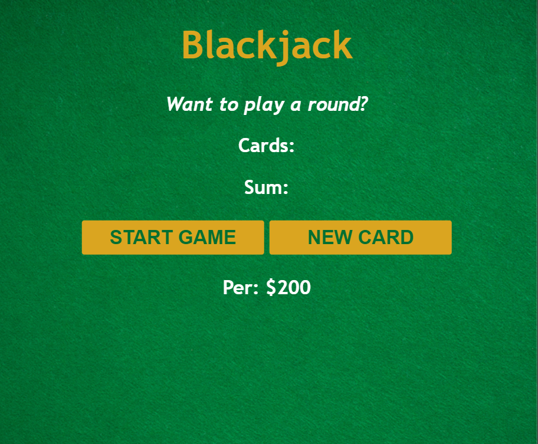

# [SDF05] Project Brief: Blackjack Game on GitHub

In this project, you will dive into creating a Blackjack game, a popular card game, using Scrimba. By the end of this course, you'll have built a fully functional game and deepened your understanding of JavaScript, including arrays, loops, and objects. Additionally, you'll be guided through basic best practices for mini-game development and user experience enhancement.

### Project Requirements

- Setup up your own Starter Code SDF05 Repo
- Code along in VSCode with Scrimba
- Build and customise your version of the Blackjack game.
- Ensure the game operates smoothly and maintains a consistent style.
- Submit your GitHub Repo link of your completed BlackJack Game to the LMS on the SDF05 Project Tab

# Code Along with the Blackjack Game in VSCode

This guide will walk you through the process of forking the Blackjack game starter code from GitHub, and then coding along with Scrimba's Blackjack game course using Visual Studio Code (VSCode). By the end of this guide, you will have a local development environment set up to work on your Blackjack game project.

## Step 1: Fork the Repository 

Forking allows you to have a personal copy of the project on their GitHub account, which you can then clone to your local machine, make changes, commit, and push back to your forked version without affecting the original repository.

1. **Navigate to the Repository:** Go to the SDF05 GitHub repository. Look for a button labeled **Fork** in the top-right corner of the page.
2. **Fork the Repository:** Click the **Fork** button. This creates a copy of the repository in your own GitHub account, allowing you to make changes without affecting the original code.

### Step 2: Clone Your Forked Repository
1. On your forked repository page, click the **Code** button and copy the URL under "Clone with HTTPS".
2. **Open** Visual Studio Code (VSCode) and access the terminal (Terminal > New Terminal).
3. Type `git clone`, paste the URL you copied, and press **Enter**. This clones the repository to your local machine.

## Step 3: Open the Project in VSCode

1. **Open Folder:** In VSCode, go to **File > Open Folder**.
2. **Select the Project Folder:** Navigate to the location where you cloned the repository, select the folder, and click **Open**. Now, you should see the project files in the VSCode sidebar.
## Step 4: Code Along with Scrimba

The course spans roughly two and a half hours. Completion of all 54 lessons is mandatory.

1. **Access the Scrimba Course:** Open the [Scrimba's Blackjack course](https://scrimba.com/playlist/p3py7U7) in your web browser.
2. **Follow Along:** As you progress through the Scrimba lessons, switch back to VSCode to apply what you've learned to your local project files.
3. **Save Your Work:** Regularly save your files in VSCode by pressing **Ctrl+S** (Windows/Linux) or **Cmd+S** (Mac).

## Step 5: Test Your Game Locally

1. **Open the HTML File:** Right-click the `index.html` file in the VSCode sidebar and select **Open with Live Server** if you have the [Live Server extension]([Live Server Extension for Visual Studio Code | Full Tutorial (youtube.com)](https://www.youtube.com/watch?v=_Tl-6HeV0Rc&t=269s)) installed. Alternatively, you can open the file in your browser by navigating to the file location.
2. **Test the Game:** Interact with your game in the browser to test its functionality. Make adjustments in VSCode as needed.

## Step 6: Commit and Push Changes 

Once you are done and you wish to update your GitHub fork with the changes:

1. After making changes, **commit** them to your local repository. Use commands like `git add .`, `git commit -m "description of changes"`, and `git push` to push changes to your forked repository on GitHub.

## Step 7: Submit Your Project

Once you've completed and tested your Blackjack game:

1. **Generate a Public Link:** If you've pushed your project to GitHub, your repository URL is what you'll need. 
2. **Submit on LMS:** Submit your project on the Learning Management System (LMS).

### Happy Coding!
Dive into game development with this project. Enjoy learning, applying your knowledge, and overcoming challenges along the way!
